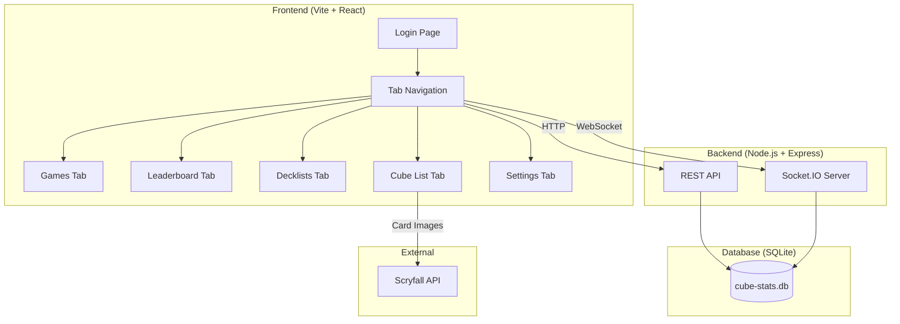
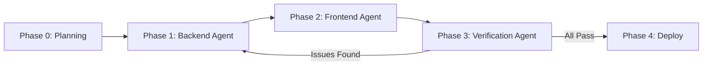

# Cube Stats v2 — Complete Revamp Plan

A from-scratch rebuild of the MTG Cube Stats website, transforming it from a per-user cube tracker into a **single shared cube** platform with full **tournament management**, **decklists**, **leaderboards**, and a **life tracker** — all hosted on Aiden's Raspberry Pi.

---

## User Review Required

> [!IMPORTANT]
> **Single shared cube model**: The entire site revolves around ONE master cube list. Only the host (you) can edit it. All other users are viewers/players. This is a fundamental shift from the v1 per-user model.

> [!IMPORTANT]
> **Multi-agent workflow**: Antigravity IDE does **not** currently support multiple AI agents working in real-time on the same codebase simultaneously. The recommended approach is **sequential phases** — one agent per phase (backend → frontend → verification), each completing before the next starts. I (Antigravity) will execute all phases sequentially in this conversation, but each phase is designed to be self-contained enough that you could hand it off.

> [!WARNING]
> **Technology choices** — please confirm:
> 1. **Frontend framework**: I'm proposing **Vite + React** for the SPA. This gives us component-based UI, routing, and hot reload. If you prefer to stay vanilla HTML/JS or want Vue/Svelte, let me know.
> 2. **Database**: I'm proposing **SQLite via better-sqlite3** (synchronous, file-based, no extra server) — ideal for a Pi. PostgreSQL is an option if you want more power later.
> 3. **Card art source**: mtgpics.com has **no API** and has been unreliable (slow loads, broken redirects). I'll use **Scryfall's `art_crop`** image format instead — it gives a rectangular crop of just the card artwork (varies in size, JPG). These will be pre-cached on first cube version creation for fast backgrounds.
> 3. **Real-time**: **Socket.IO** for live tournament updates, draft timers, and life tracking.
> 4. **Deployment**: Keep Docker + Cloudflare Tunnel to `cube.frizzt.com`.

> [!CAUTION]
> **Breaking change**: The v1 JSON blob data model will be completely replaced with a normalized relational schema. A migration script will be provided to import existing data from `data/cube-stats.db`.

---

## Copyright Compliance

Per the [Wizards of the Coast Fan Content Policy](https://company.wizards.com/en/legal/fancontentpolicy) (updated Dec 2025), this project qualifies as **non-commercial fan content**. Requirements:

1. **Required disclaimer** on every page footer:
   > *"Cube Stats is unofficial Fan Content permitted under the Fan Content Policy. Not approved/endorsed by Wizards. Portions of the materials used are property of Wizards of the Coast. ©Wizards of the Coast LLC."*
2. **No WotC logos or mana symbols** used as assets (card images fetched via Scryfall are fine)
3. **No paywalls** — the site must be free to access
4. **Credit artists** when displaying `art_crop` backgrounds (artist name from Scryfall API)

---

## Architecture Overview



---

## Data Model (Normalized SQLite Schema)

```sql
-- Users & Auth
CREATE TABLE users (
    id INTEGER PRIMARY KEY AUTOINCREMENT,
    username TEXT UNIQUE NOT NULL,
    password_hash TEXT NOT NULL,
    display_name TEXT,
    avatar_url TEXT,
    role TEXT NOT NULL DEFAULT 'player',  -- 'host' or 'player'
    remember_token TEXT,                  -- for "Remember Me" persistent sessions
    created_at DATETIME DEFAULT CURRENT_TIMESTAMP
);

-- Master Cube List (one active list at a time, versioned)
CREATE TABLE cube_versions (
    id INTEGER PRIMARY KEY AUTOINCREMENT,
    name TEXT NOT NULL,              -- e.g. "Lorwyn Eclipsed"
    start_date DATE NOT NULL,
    end_date DATE,                   -- NULL = current version
    created_by INTEGER REFERENCES users(id),
    created_at DATETIME DEFAULT CURRENT_TIMESTAMP
);

CREATE TABLE cube_cards (
    id INTEGER PRIMARY KEY AUTOINCREMENT,
    version_id INTEGER REFERENCES cube_versions(id) ON DELETE CASCADE,
    card_name TEXT NOT NULL,
    scryfall_id TEXT,
    image_url TEXT,               -- normal card image
    art_crop_url TEXT,            -- art-only crop for backgrounds
    artist TEXT,                  -- for copyright attribution
    UNIQUE(version_id, card_name)
);

-- Pre-cached artwork for login backgrounds
CREATE TABLE cached_artworks (
    id INTEGER PRIMARY KEY AUTOINCREMENT,
    card_name TEXT NOT NULL,
    art_crop_url TEXT NOT NULL,   -- Scryfall art_crop URL
    local_path TEXT,              -- local cached file path
    artist TEXT NOT NULL,         -- for attribution
    dominant_color TEXT,          -- hex color extracted for UI theming
    UNIQUE(card_name)
);

CREATE TABLE image_overrides (
    card_name TEXT NOT NULL,
    image_url TEXT NOT NULL,
    set_by INTEGER REFERENCES users(id),
    PRIMARY KEY (card_name)
);

-- Tournaments
CREATE TABLE tournaments (
    id INTEGER PRIMARY KEY AUTOINCREMENT,
    name TEXT NOT NULL,
    join_code TEXT UNIQUE NOT NULL,   -- 6-char alphanumeric
    status TEXT NOT NULL DEFAULT 'lobby',  -- lobby/drafting/deckbuilding/playing/complete
    format TEXT NOT NULL DEFAULT 'bo1',    -- bo1/bo3
    max_players INTEGER DEFAULT 8,
    draft_timer_enabled BOOLEAN DEFAULT FALSE,
    draft_timer_seconds INTEGER DEFAULT 60,
    match_timer_enabled BOOLEAN DEFAULT FALSE,
    match_timer_minutes INTEGER DEFAULT 50,
    current_round INTEGER DEFAULT 0,
    total_rounds INTEGER,
    cube_version_id INTEGER REFERENCES cube_versions(id),
    created_by INTEGER REFERENCES users(id),
    created_at DATETIME DEFAULT CURRENT_TIMESTAMP,
    started_at DATETIME,
    completed_at DATETIME
);

CREATE TABLE tournament_players (
    id INTEGER PRIMARY KEY AUTOINCREMENT,
    tournament_id INTEGER REFERENCES tournaments(id) ON DELETE CASCADE,
    user_id INTEGER REFERENCES users(id),
    seat_number INTEGER,
    decklist_submitted BOOLEAN DEFAULT FALSE,
    UNIQUE(tournament_id, user_id)
);

-- Decklists
CREATE TABLE decklists (
    id INTEGER PRIMARY KEY AUTOINCREMENT,
    tournament_id INTEGER REFERENCES tournaments(id) ON DELETE CASCADE,
    user_id INTEGER REFERENCES users(id),
    deck_title TEXT,
    submitted_at DATETIME DEFAULT CURRENT_TIMESTAMP,
    UNIQUE(tournament_id, user_id)
);

CREATE TABLE decklist_cards (
    decklist_id INTEGER REFERENCES decklists(id) ON DELETE CASCADE,
    card_name TEXT NOT NULL,
    quantity INTEGER DEFAULT 1,
    is_sideboard BOOLEAN DEFAULT FALSE,
    PRIMARY KEY (decklist_id, card_name, is_sideboard)
);

-- Matches & Results
CREATE TABLE matches (
    id INTEGER PRIMARY KEY AUTOINCREMENT,
    tournament_id INTEGER REFERENCES tournaments(id) ON DELETE CASCADE,
    round_number INTEGER NOT NULL,
    player1_id INTEGER REFERENCES users(id),
    player2_id INTEGER REFERENCES users(id),
    player1_wins INTEGER DEFAULT 0,
    player2_wins INTEGER DEFAULT 0,
    draws INTEGER DEFAULT 0,
    result_submitted_by INTEGER REFERENCES users(id),
    status TEXT DEFAULT 'pending',  -- pending/in_progress/complete
    started_at DATETIME,
    completed_at DATETIME
);

-- Life tracking (ephemeral, but persisted for reconnect)
CREATE TABLE life_totals (
    match_id INTEGER REFERENCES matches(id) ON DELETE CASCADE,
    user_id INTEGER REFERENCES users(id),
    life INTEGER DEFAULT 20,
    PRIMARY KEY (match_id, user_id)
);
```

---

## Proposed Changes

### Agent 1: Backend Foundation

#### [NEW] [package.json](file:///home/aiden/Projects/host-cube-stats/package.json)
Complete rewrite. New dependencies:
- `express`, `cors`, `helmet` — HTTP server
- `better-sqlite3` — synchronous SQLite
- `bcryptjs`, `jsonwebtoken` — auth
- `socket.io` — real-time events
- `uuid` — unique IDs
- `multer` — avatar uploads
- `dotenv` — env config
- Dev: `nodemon`, `vitest` for backend tests

#### [NEW] [src/server.js](file:///home/aiden/Projects/host-cube-stats/src/server.js)
Express server setup with middleware, static file serving, and Socket.IO initialization.

#### [NEW] [src/db/schema.sql](file:///home/aiden/Projects/host-cube-stats/src/db/schema.sql)
The normalized schema shown above.

#### [NEW] [src/db/database.js](file:///home/aiden/Projects/host-cube-stats/src/db/database.js)
Database initialization, connection management, migration runner.

#### [NEW] [src/middleware/auth.js](file:///home/aiden/Projects/host-cube-stats/src/middleware/auth.js)
JWT middleware + role-based access control (`requireHost`, `requireAuth`).

#### [NEW] [src/routes/auth.js](file:///home/aiden/Projects/host-cube-stats/src/routes/auth.js)
`POST /api/register`, `POST /api/login`, `GET /api/verify`, `PUT /api/profile` (display name, avatar).

#### [NEW] [src/routes/cube.js](file:///home/aiden/Projects/host-cube-stats/src/routes/cube.js)
- `GET /api/cube/versions` — list all versions
- `GET /api/cube/current` — get current version with cards
- `GET /api/cube/version/:id` — get specific version
- `POST /api/cube/version` — create new version (host-only)
- `PUT /api/cube/version/:id` — update version (host-only)
- `POST /api/cube/cards/override-image` — set image override

#### [NEW] [src/routes/tournaments.js](file:///home/aiden/Projects/host-cube-stats/src/routes/tournaments.js)
- `POST /api/tournaments` — create tournament (host-only)
- `GET /api/tournaments` — list tournaments (active + past)
- `GET /api/tournaments/:id` — tournament details
- `POST /api/tournaments/:id/join` — join via code
- `PUT /api/tournaments/:id/seating` — set seating (host-only)
- `PUT /api/tournaments/:id/status` — advance status (host-only)
- `GET /api/tournaments/:id/standings` — calculate standings

#### [NEW] [src/routes/decklists.js](file:///home/aiden/Projects/host-cube-stats/src/routes/decklists.js)
- `POST /api/tournaments/:id/decklist` — submit decklist
- `GET /api/tournaments/:id/decklists` — view all decklists
- `PUT /api/decklists/:id` — edit decklist (owner or host post-tournament)

#### [NEW] [src/routes/matches.js](file:///home/aiden/Projects/host-cube-stats/src/routes/matches.js)
- `GET /api/tournaments/:id/matches` — get round pairings
- `POST /api/matches/:id/result` — submit match result
- `GET /api/leaderboard` — global player leaderboard

#### [NEW] [src/services/swiss.js](file:///home/aiden/Projects/host-cube-stats/src/services/swiss.js)
Swiss pairing algorithm: pair players with similar records, avoid rematches, handle byes for odd numbers.

#### [NEW] [src/services/standings.js](file:///home/aiden/Projects/host-cube-stats/src/services/standings.js)
Calculate Match Points, OMW%, GW%, OGW% per official WotC tiebreaker rules.

#### [NEW] [src/services/scryfall.js](file:///home/aiden/Projects/host-cube-stats/src/services/scryfall.js)
Server-side Scryfall proxy with rate limiting (100ms between requests), caching, DFC normalization. Also handles:
- Fetching `art_crop` URLs + artist names for background artwork cache
- Dominant color extraction from art crops (using `sharp` or canvas-based sampling)

#### [NEW] [src/services/decklist-image.js](file:///home/aiden/Projects/host-cube-stats/src/services/decklist-image.js)
Moxfield-style decklist image generator using **`node-canvas`** (or `sharp` compositing):
- Renders a visual decklist as a single image (PNG)
- Layout: deck title header, cards sorted by type (Creatures, Instants, Sorceries, etc.) in visual stacks
- Each card shown as a small card image, quantity badge, sorted by CMC within type
- Footer with player name, tournament name, date, record
- Output: downloadable PNG, shareable on social media
- API: `GET /api/decklists/:id/image` returns PNG

#### [NEW] [src/socket/tournament.js](file:///home/aiden/Projects/host-cube-stats/src/socket/tournament.js)
Socket.IO namespace for tournament events:
- `tournament:join` / `tournament:leave`
- `draft:timer-tick` / `draft:timer-complete`
- `match:life-update` — broadcast life total changes
- `match:result-submitted` — notify standings update
- `tournament:status-change` — lobby → drafting → deckbuilding → playing → complete

---

### Agent 2: Frontend UI

#### [NEW] [client/](file:///home/aiden/Projects/host-cube-stats/client/)
Vite + React app (created via `npx create-vite`).

#### Key pages/components:

| Page/Component | Description |
|---|---|
| `LoginPage` | Login/register with "Remember Me" checkbox (stores JWT in localStorage with extended 30-day expiry) |
| `AppShell` | Tab navigation: Games, Leaderboard, Decklists, Cube List, Settings |
| `GamesTab` | Active tournaments (joinable), past tournaments (viewable), create button (host-only) |
| `TournamentLobby` | Player list, join code display, seating arrangement (host), draft settings, start button |
| `DraftTimer` | Countdown timer synced via Socket.IO |
| `DecklistSubmit` | Card textarea with parser, preview, ready status indicator |
| `MatchupsView` | Round pairings with result submission forms |
| `LifeTracker` | Interactive life counter (tap +/- or swipe), synced per-player |
| `StandingsView` | Tournament standings table with export-to-image button |
| `LeaderboardTab` | Global player stats aggregated from all tournaments |
| `DecklistsTab` | Browse decklists by tournament, visual card grid |
| `CubeListTab` | Card image gallery with version dropdown filter, Scryfall images |
| `SettingsPage` | Profile picture (upload), display name, password change |
| `Toast` | Global toast notification system |

#### Design System:
- **Dynamic card art backgrounds**: On the login page, a random card artwork from the cube is displayed full-bleed as the background (fetched from the `cached_artworks` table). On login, it blurs and the UI color scheme adapts to the artwork's dominant color (extracted server-side on cache). The background subtly transitions to a new random art every ~30 seconds.
- Dark theme (refined from v1's `#0f172a` → `#1e293b` gradient) with **adaptive accent colors** derived from the background artwork
- Inter font from Google Fonts
- Glassmorphic card components with backdrop blur over the art background
- Smooth micro-animations and transitions
- Mobile-first responsive design
- MTG-themed accent colors (gold/amber primary, deep purple secondary) as defaults when no art is loaded
- **WotC copyright disclaimer** in the footer of every page
- **Artist credit overlay** on background artwork (small, bottom-corner)

---

### Agent 3: Verification & Integration

#### [NEW] [src/tests/](file:///home/aiden/Projects/host-cube-stats/src/tests/)
Backend tests using Vitest:
- `auth.test.js` — registration, login, token validation, role checks
- `cube.test.js` — CRUD operations, versioning, host-only enforcement
- `tournament.test.js` — full tournament lifecycle
- `swiss.test.js` — pairing correctness, bye handling
- `standings.test.js` — WotC tiebreaker calculation accuracy

#### [NEW] [src/scripts/migrate-v1.js](file:///home/aiden/Projects/host-cube-stats/src/scripts/migrate-v1.js)
Migration script: reads v1 `data/cube-stats.db` JSON blobs, normalizes into the new schema.

---

## Project Structure (Final)

```
host-cube-stats/
├── src/                        # Backend
│   ├── server.js               # Express + Socket.IO entry
│   ├── db/
│   │   ├── schema.sql
│   │   └── database.js
│   ├── middleware/
│   │   └── auth.js
│   ├── routes/
│   │   ├── auth.js
│   │   ├── cube.js
│   │   ├── tournaments.js
│   │   ├── decklists.js
│   │   └── matches.js
│   ├── services/
│   │   ├── swiss.js
│   │   ├── standings.js
│   │   └── scryfall.js
│   ├── socket/
│   │   └── tournament.js
│   ├── scripts/
│   │   └── migrate-v1.js
│   └── tests/
│       ├── auth.test.js
│       ├── cube.test.js
│       ├── tournament.test.js
│       ├── swiss.test.js
│       └── standings.test.js
├── client/                     # Frontend (Vite + React)
│   ├── src/
│   │   ├── pages/
│   │   ├── components/
│   │   ├── hooks/
│   │   ├── services/
│   │   └── styles/
│   ├── index.html
│   └── vite.config.js
├── data/                       # SQLite DB (gitignored)
├── Dockerfile
├── docker-compose.yml
├── package.json
└── README.md
```

---

## Multi-Agent Execution Strategy

Since real-time multi-agent collaboration isn't supported, the workflow is **sequential phases**:



| Phase | Agent Role | What It Does |
|-------|-----------|--------------|
| **0. Planning** | Antigravity (me) | This plan. You approve, then I execute. |
| **1. Backend** | Antigravity | Build all API routes, DB schema, services, Socket.IO events. Write backend tests. |
| **2. Frontend** | Antigravity | Build React SPA with all pages, components, and Socket.IO integration. |
| **3. Verification** | Antigravity | Run all backend tests, browser-test the full tournament flow, fix issues. |
| **4. Deploy** | Antigravity | Update Dockerfile, docker-compose, deploy script. Run migration. |

Each phase ends with a checkpoint where you can review before proceeding.

---

## Verification Plan

### Automated Tests
- **Backend unit tests**: `npx vitest run` in the project root
  - Auth flow (register → login → verify → reject bad tokens)
  - Cube CRUD (create version → add cards → list → get current)
  - Tournament lifecycle (create → join → seat → draft → submit decklist → pair → submit results → standings)
  - Swiss pairing edge cases (odd players, rematches)
  - Standings calculation against known expected values
- **Frontend**: Browser-based smoke test using the `browser_subagent` tool
  - Navigate to login page → register → login → verify redirect to Games tab
  - Create tournament (as host) → verify it appears in Games tab
  - Join tournament → verify lobby shows all players

### Manual Verification (by you, Aiden)
1. **Deploy to your Pi** via `docker compose up`
2. **Login** with your host account at `cube.frizzt.com`
3. **Create a cube version** with a small test list (maybe 10 cards)
4. **Create a tournament** → share join code with a friend → verify they can join
5. **Run a mini tournament**: draft → submit decklists → play rounds → verify standings
6. **Check the Leaderboard tab** shows aggregated stats
7. **Export the standings image** and verify it looks good for posting

---

## Future Enhancements (Post-MVP)

These are explicitly **out of scope** for v2.0 but documented for later:
- Camera-based card scanning for decklists
- Basic land suggestions based on mana curve analysis
- Permission system for other users to edit the cube list
- Elo rating system for cards and players
- CubeCobra import by cube ID
- Tagging & archetype analysis
- Real-time draft pick tracking (see what others pick)
- Offline-first with service workers
- Push notifications for tournament events
- Advanced decklist image templates (different layouts, custom backgrounds)
