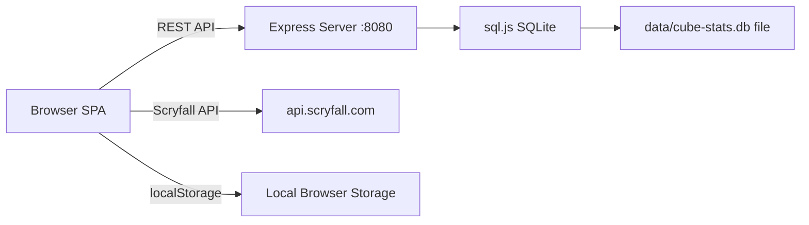

# MTG Cube Leaderboard — Complete Project Description for Migration

> **Purpose**: This document describes every important aspect of the existing `host-cube-stats` project so that a future AI (or developer) can build a revamped replacement from scratch, preserving all essential functionality and domain logic.

---

## 1. Project Overview

**Name**: Cube Stats / MTG Cube Leaderboard  
**Domain**: Magic: The Gathering (MTG) — specifically **Cube** drafting  
**Live URL**: `cube.frizzt.com` (port 8888 via Cloudflare Tunnel)  
**Purpose**: Track card performance (maindeck rates) and player statistics across cube draft sessions. Users import their cube list, log game results with decklists, and view leaderboards showing which cards are played most/least and which players perform best.

---

## 2. Architecture Summary

| Layer | Technology | Notes |
|-------|-----------|-------|
| **Frontend** | Vanilla HTML/CSS/JS (SPA) | Single class `CubeLeaderboard` (~1350 lines), no framework |
| **Backend** | Node.js + Express 4.18 | 4 API routes, serves static files |
| **Database** | SQLite via `sql.js` (in-memory + file persistence) | Writes buffer to disk on every mutation |
| **Auth** | JWT (`jsonwebtoken`) + bcrypt | 7-day token expiry, Bearer header |
| **Deployment** | Docker (node:20-alpine) + docker-compose | rsync-based deploy script to remote server |



---

## 3. Data Model

### 3.1 Client-Side Data Shape (localStorage key: `cubeLeaderboardData`)

```json
{
  "masterCubeList": ["Card Name A", "Card Name B", ...],
  "games": [
    {
      "date": "2025-01-15",
      "player": "PlayerName",
      "deckTitle": "UW Control",
      "wins": 3,
      "losses": 1,
      "decklist": ["Card Name A", "Card Name C", ...]
    }
  ],
  "imageOverrides": {
    "Card Name": "https://scryfall-image-url..."
  }
}
```

> [!IMPORTANT]
> The entire user dataset is stored as a **single JSON blob** both client-side (localStorage) and server-side (the `data_json` column). There is no granular row-per-game or row-per-card in the database; migration should consider normalizing this.

### 3.2 Server-Side Database Schema

```sql
CREATE TABLE users (
    id INTEGER PRIMARY KEY AUTOINCREMENT,
    username TEXT UNIQUE NOT NULL,
    password_hash TEXT NOT NULL,
    created_at DATETIME DEFAULT CURRENT_TIMESTAMP
);

CREATE TABLE cube_data (
    id INTEGER PRIMARY KEY AUTOINCREMENT,
    user_id INTEGER UNIQUE NOT NULL,   -- One blob per user
    data_json TEXT NOT NULL,            -- The entire JSON from 3.1
    updated_at DATETIME DEFAULT CURRENT_TIMESTAMP,
    FOREIGN KEY (user_id) REFERENCES users(id)
);
```

---

## 4. API Endpoints

| Method | Endpoint | Auth | Description |
|--------|----------|------|-------------|
| `POST` | `/api/register` | No | Create account (username ≥3 chars, password ≥6 chars, bcrypt 12 rounds) |
| `POST` | `/api/login` | No | Returns JWT token + user object |
| `GET` | `/api/verify` | JWT | Verify token validity |
| `GET` | `/api/data` | JWT | Retrieve user's entire data JSON blob |
| `POST` | `/api/data` | JWT | Save user's entire data JSON blob (10MB limit) |

**Auth mechanism**: JWT in `Authorization: Bearer <token>` header, 7-day expiry, secret key from `JWT_SECRET` env var.

---

## 5. Core Features (Functional Requirements)

### 5.1 Cube List Management
- **Import cube list** by pasting card names (one per line) in a textarea
- **Edit/update** the cube list in Settings
- **Card validity testing** against the Scryfall API — checks each card exists and reports invalid names
- Cube list is the **master reference** for all statistics; cards not in the list can still be logged but trigger a warning

### 5.2 Game Entry
- Fields: **date**, **player name**, **deck title**, **wins** (number), **losses** (number), **decklist** (textarea, one card per line)
- Decklist parser handles formats: `"1 Lightning Bolt"`, `"2x Sol Ring"`, or plain `"Black Lotus"` — quantity prefixes are stripped (only unique card names are stored, not quantities)
- **Double-faced card (DFC) handling**: Normalises names like `"Delver of Secrets // Insectile Aberration"` → `"Delver of Secrets"`. Matches decklists to cube list via front-face, back-face, or full DFC name
- Cards not found in the cube list produce a warning but can be added with user confirmation
- Recent games (last 5) shown with edit/delete capability

### 5.3 Card Leaderboard
- **Primary metric: Maindeck Rate** = `(times card appeared in decks) / (total number of decks)`
- Additional stats per card: total appearances, total wins, total losses, win rate
- **Filters**: search by card name, date range (from/to)
- **View modes**: Bottom 20 (rotation candidates), Top 20 (best performers), All
- **Display modes**: Grid view (with Scryfall card images) or List view
- **Sort order**: Ascending/Descending toggle (only shown in "All" view)

### 5.4 Card Image System
- Fetches card images from `api.scryfall.com/cards/named?fuzzy=` (uses `small` size, falls back to `normal`)
- Handles double-faced cards (checks `card_faces[0].image_uris` when `image_uris` is absent)
- **Custom art picker modal**: Click any card in the grid → opens a modal to search all printings via `api.scryfall.com/cards/search` → select preferred art
- Selected art stored in `imageOverrides` map (persists to localStorage and server)
- In-memory `scryfallCache` for de-duplicating API calls within a session

### 5.5 Player Leaderboard
- Aggregates all games by player name
- Stats per player: drafts (number of deck entries), total wins, total losses, total games (wins+losses), **win rate** (wins / games)
- Sorted by win rate descending

### 5.6 Monthly Report Generation
- Filter games by month
- Shows top 20 and bottom 20 by a "total score" metric
- Renders card grids with images and detailed statistics

### 5.7 Data Import/Export
- **Export**: Downloads entire data object as a dated JSON file (`cube-leaderboard-backup-YYYY-MM-DD.json`)
- **Import**: Loads a JSON file, validates it has `masterCubeList` and `games`, replaces current data
- **Reset**: Double-confirmation prompt, clears localStorage

### 5.8 Authentication & Cloud Sync
- Login/Register modal (switches between modes in-place)
- On **register**: uploads current local data to server
- On **login**: downloads server data, overwrites local data
- Manual **Sync button** in header: saves current local data to server
- Token + user stored in `localStorage` (`cubeAuthToken`, `cubeAuthUser`)
- On page load: verifies token, if valid loads data from server
- **Offline-capable**: App works fully from localStorage without auth; server sync is optional

---

## 6. Scoring & Formulas

### 6.1 Maindeck Rate (primary, used in leaderboard)
```
maindeck_rate = appearances / total_decks
```
Where `appearances` is how many decks contained the card, and `total_decks` is the total number of game entries.

### 6.2 CUS Scoring Weights (present in code but partially unused)
```javascript
calculateWeights(format, draftType) {
    const draftWeight = draftType === 'winston' ? 1.0 : 0.9;  // pick-two = 0.9
    let formatWeight = 1.0;
    if (format === 'bo1') formatWeight = 0.95;
    else if (format === 'ffa') formatWeight = 0.85;
    return { draftWeight, formatWeight };
}
```

> [!NOTE]
> The `calculateWeights` function exists but is **not actively called** in the leaderboard flow. The main leaderboard uses simple maindeck rate. The monthly report references a `totalScore` property that doesn't get populated by `calculateCardScores`. This is a **known incomplete feature** that the revamp should either fully implement or remove.

---

## 7. UI/UX Design

### 7.1 Design System
- **Dark theme**: Background gradient `#0f172a → #1e293b`, card surfaces `#1e293b`
- **Color palette**: Primary indigo `#6366f1`, secondary purple `#8b5cf6`, success green `#10b981`, danger red `#ef4444`, warning amber `#f59e0b`
- **Typography**: Inter → Segoe UI → system-ui; monospace for textareas (Consolas/Monaco)
- **Components**: Glassmorphic cards with `backdrop-filter: blur(10px)`, gradient title text, 16px border-radius cards, hover-lift effects

### 7.2 Layout & Navigation
- **Welcome screen**: Shown when no cube list exists. Offers paste-import or JSON-import
- **Main app**: 4 tabs — ➕ Add Game, 🃏 Cards, 👥 Players, ⚙️ Settings
- Tab switching uses CSS class toggling (`.active` on tab-btn and tab-content)
- Fade-in animation on tab switch (`translateY(10px)` → `translateY(0)`)
- **Header**: Title + subtitle on left, account area (Login btn or username + sync + logout) on right

### 7.3 Modals
1. **Card Art Picker**: Search Scryfall for alternative printings, select to override default image
2. **Auth Modal**: Login/Register form with error display and mode toggle

### 7.4 Responsiveness
- Grid columns collapse to single column at `≤768px`
- Buttons go full-width on mobile
- Filter toggles stack vertically on mobile
- Card grid uses `auto-fill, minmax(140px, 1fr)`

### 7.5 Notifications
- Currently uses `alert()` — crude but functional. The revamp should implement a proper toast system

---

## 8. External Integrations

### 8.1 Scryfall API
- **Card image lookup**: `GET https://api.scryfall.com/cards/named?fuzzy={name}` — returns card data including image URLs
- **Print search**: `GET https://api.scryfall.com/cards/search?q={query}&unique=prints&order=released` — for the art picker modal
- Handles DFC-specific queries with `name:"Front // Back"` syntax and `include:extras` flag
- Uses `small` image size primarily, falls back to `normal`
- **Rate limiting consideration**: Scryfall requests 50-100ms between requests; current code does not throttle

---

## 9. Deployment & Infrastructure

### 9.1 Docker
- **Base image**: `node:20-alpine`
- **Exposed port**: 8080 inside container, mapped to 8888 on host
- **Volume**: `./data:/app/data` for SQLite persistence
- **Env vars**: `NODE_ENV`, `PORT`, `JWT_SECRET`

### 9.2 Deploy Script (`deploy.sh`)
- rsync files to remote `aiden@100.111.229.55:~/cube/cube-stats` (Tailscale IP)
- Excludes `data/`, `node_modules/`, `.git/`, `package-lock.json`
- SSH to rebuild and restart Docker container

### 9.3 Network
- Cloudflare Tunnel from `cube.frizzt.com` → localhost:8888

---

## 10. Known Issues & Gaps for the Revamp

| Issue | Severity | Detail |
|-------|----------|--------|
| **No data normalization** | High | All data stored as a single JSON blob per user; no row-per-game in DB |
| **CUS scoring incomplete** | Medium | `calculateWeights` function exists but isn't wired into leaderboard scoring |
| **`totalScore` undefined** | Medium | Monthly report references `item.totalScore` but `calculateCardScores` doesn't compute it |
| **No rate limiting for Scryfall** | Medium | Bulk image fetches could hit Scryfall rate limits |
| **`alert()` for notifications** | Low | Should use toast/snackbar UI |
| **sql.js writes on every mutation** | Medium | Full DB export to file on every insert/update; not scalable |
| **No password change/reset** | Low | Auth has no forgot-password or change-password flow |
| **No data migration path** | Medium | No versioning of the data format |
| **Inline HTML generation** | Low | Template strings used for all rendering; XSS risk from card names |
| **Game entries have no unique IDs** | Medium | Games identified by array index; editing/deleting is fragile |
| **No multi-user cube sharing** | Low | Each user has isolated data; no ability to share a cube among a playgroup |
| **serve.sh uses Python HTTP server** | Low | Legacy script, not actually used in production (Docker uses Node) |

---

## 11. Data for Migration

### 11.1 Existing User Data
The SQLite database at `data/cube-stats.db` contains real user data that should be migrated. The JSON structure in `data_json` can be parsed and decomposed into normalized tables.

### 11.2 Recommended New Schema (suggestion for the revamp)
```sql
-- Normalize games into their own rows
CREATE TABLE games (
    id UUID PRIMARY KEY,
    user_id INTEGER REFERENCES users(id),
    date DATE,
    player_name TEXT,
    deck_title TEXT,
    wins INTEGER,
    losses INTEGER,
    created_at TIMESTAMP
);

CREATE TABLE game_cards (
    game_id UUID REFERENCES games(id),
    card_name TEXT,
    PRIMARY KEY (game_id, card_name)
);

CREATE TABLE cube_cards (
    user_id INTEGER REFERENCES users(id),
    card_name TEXT,
    PRIMARY KEY (user_id, card_name)
);

CREATE TABLE image_overrides (
    user_id INTEGER REFERENCES users(id),
    card_name TEXT,
    image_url TEXT,
    PRIMARY KEY (user_id, card_name)
);
```

---

## 12. Feature Priorities for the Revamp

Based on usage patterns and code analysis:

**Must-have** (core value):
- Cube list import and management
- Game entry with decklist parsing (including DFC handling)
- Card maindeck rate leaderboard with grid/list views and filters
- Scryfall card image integration with art picker
- Player leaderboard
- Data export/import (JSON)
- User authentication and cloud sync

**Should-have** (improve on existing):
- Proper toast notification system (replace `alert()`)
- Normalized database schema
- Game entries with stable UUIDs
- Proper Scryfall rate limiting
- Input sanitization / XSS protection
- Data format versioning

**Nice-to-have** (new features):
- Shared cubes / playgroup support
- Fully implemented CUS scoring formula with configurable weights
- Password reset flow
- Real-time sync (WebSockets)
- Offline-first with service workers
- Card statistics drill-down (click a card to see all decks it appeared in)

---

## 13. Environment & Configuration

| Variable | Default | Description |
|----------|---------|-------------|
| `PORT` | `8080` | Server port |
| `JWT_SECRET` | `cube-stats-secret-key-change-in-production` | JWT signing key |
| `DB_PATH` | `./data/cube-stats.db` | SQLite file path |
| `NODE_ENV` | (unset) | Set to `production` in Docker |

---

## 14. File Inventory

| File | Size | Purpose |
|------|------|---------|
| `server.js` | 5KB | Express server, routes, middleware |
| `auth.js` | 1KB | JWT generation and verification middleware |
| `database.js` | 3KB | sql.js database init, CRUD functions |
| `public/index.html` | 12KB | SPA shell, all HTML structure |
| `public/app.js` | 52KB | All frontend logic, `CubeLeaderboard` class |
| `public/styles.css` | 16KB | Complete dark-theme stylesheet |
| `Dockerfile` | 359B | Docker build config |
| `docker-compose.yml` | 353B | Docker Compose with volume + env |
| `deploy.sh` | 810B | rsync + Docker rebuild deploy script |
| `package.json` | 413B | Dependencies: express, bcryptjs, jsonwebtoken, sql.js, cors |
