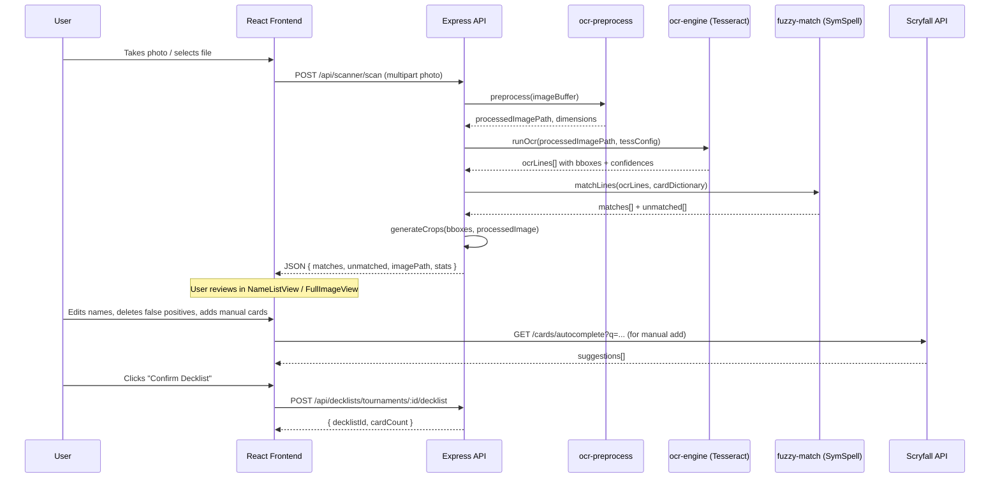

# Card Scanner — Photo-to-Decklist OCR Feature

Add a "Scan Deck" capability to Cube Stats that lets a player photograph their fanned/stacked draft pool, automatically OCR the visible card names, fuzzy-match them against the MTGJSON dictionary, and produce a verified decklist — all locally on a Raspberry Pi 4 with zero cloud API calls.

## User Review Required

> [!NOTE]
> **Confirmed decisions**: Using `sharp` for preprocessing (no OpenCV/Python). Target device is **Pi 4 (4 GB)**. Custom `mtg.traineddata` will be placed in the project root by the user. Card name dictionary sourced from the **cube_cards DB table** (current cube iteration only). No automated tests — manual testing with guided walkthrough.

---

## Proposed Changes

### 1. OCR Pipeline Service (Backend)

The scanner is structured as **three internal modules** within a new `src/services/scanner/` directory, called by a single Express route.

---

#### [NEW] [ocr-preprocess.js](file:///home/aiden/Projects/host-cube-stats/src/services/scanner/ocr-preprocess.js)

**Image preprocessing using `sharp` (already a project dependency).**

Responsibilities:
- Accept a raw photo buffer (JPEG/PNG from multer, max 10 MB)
- Pipeline: resize to max 3000px wide → grayscale → normalize (CLAHE-equivalent via `sharp.normalize()`) → sharpen → optional 2× upscale for low-res inputs → output as high-contrast PNG for Tesseract
- Store the processed image in a temp path (`/tmp/scan_<uuid>.png`)
- Return the processed image path and dimensions

Key design notes:
- `sharp` already handles greyscale + normalize + sharpen natively; this replaces the OpenCV steps without adding a new native dependency
- If preprocessing quality is insufficient, we can swap in a Python script invoked via `child_process.execFile` without changing the route contract — this is the identified risk escape hatch

---

#### [NEW] [ocr-engine.js](file:///home/aiden/Projects/host-cube-stats/src/services/scanner/ocr-engine.js)

**Tesseract OCR execution and bounding-box extraction.**

Dependencies:
- System-level: `tesseract-ocr` (apt package, ARM-compatible)
- NPM: `node-tesseract-ocr@^2.2.1` — thin CLI wrapper, spawns `tesseract` as a child process. Chosen over `tesseract.js` (WASM) which is 3–5× slower on ARM and uses ~300 MB RAM.

Responsibilities:
- Call Tesseract on the preprocessed image with flags:
  ```
  --psm 11 --oem 1 -l mtg
  -c tessedit_create_hocr=1
  -c hocr_char_boxes=0
  ```
  - `--psm 11`: Sparse text — finds text anywhere in the image, no assumption of single column/line
  - `--oem 1`: LSTM engine (best accuracy)
  - `-l mtg`: Use the custom MTG traineddata
  - `hocr=1`: Outputs HTML with bounding box coordinates for every detected word/line
- Parse the hOCR XML output to extract:
  - Each detected text line (the `ocr_line` class in hOCR)
  - Its bounding box (`bbox` attribute) as `{ x, y, width, height }`  
  - Confidence per line (the `x_wconf` attribute)
- Filter lines: discard anything with confidence < 30 or text length < 3 characters
- Return an array of `{ text: string, bbox: { x, y, w, h }, confidence: number }`

Key design notes:
- hOCR output gives us bounding boxes **for free** — no OpenCV contour detection needed. This is the critical insight that avoids an OpenCV dependency.
- The custom `mtg.traineddata` file lives in `data/tesseract/` and is volume-mounted in Docker
- Fallback: if `mtg` traineddata is missing, fall back to `eng` with a console warning

---

#### [NEW] [fuzzy-match.js](file:///home/aiden/Projects/host-cube-stats/src/services/scanner/fuzzy-match.js)

**SymSpell fuzzy matching against the MTGJSON card name dictionary.**

Dependencies:
- NPM: `symspell-ex@^1.0.5` — JavaScript port of SymSpell with Symmetric Delete algorithm. Pure JS, no native deps, ARM-safe.
- Data: sourced from the **`cube_cards` DB table** (current active cube version only)

Responsibilities:
- On first call (lazy init), query `SELECT DISTINCT card_name FROM cube_cards WHERE version_id = (SELECT id FROM cube_versions WHERE end_date IS NULL)` to get the current cube's card names
- Load these into a SymSpell dictionary with:
  - `maxEditDistance = 3` (allows OCR typos like "Baieful Strix" → "Baleful Strix")
  - `prefixLength = 7`
- Invalidate / reload dictionary when cube version changes (check version ID on each scan)
- For each OCR line, attempt fuzzy lookup:
  1. Try exact match first (O(1) Set lookup)
  2. If no exact match, run SymSpell `lookup()` with `maxEditDistance=2`, `Verbosity.Closest`
  3. Accept the top result only if its edit distance ≤ 2 AND the original OCR text length ≥ 5 characters. Short strings (≤ 4 chars) need edit distance ≤ 1 to avoid false positives from type lines / mana symbols.
- **Noise filtering** — reject OCR lines that match common non-card patterns:
  - Lines that are pure numbers, single words matching MTG keywords (`Flying`, `Trample`, `Haste`, etc. — maintain a blocklist of ~50 common keywords)
  - Lines matching type-line patterns: `/^(Creature|Instant|Sorcery|Enchantment|Artifact|Planeswalker|Land)/i`
  - Lines matching set collector numbers: `/^\d+\/\d+$/`
  - Lines matching artist credit: `/^[A-Z][a-z]+ [A-Z][a-z]+$/` when confidence < 70
- Return for each OCR line: `{ ocrText, matchedName: string | null, editDistance: number, confidence: number }`

Key design notes:
- SymSpell pre-computation takes ~500ms on Pi 4 for 30K entries, then lookups are O(1). The dictionary stays in memory (~1.5 MB) for the server lifetime after first load.
- We do NOT filter against the cube list — the scanner should recognize any MTG card, then the user can verify/correct. The existing decklist submission route already handles image lookups from the cube.

---

*(No MTGJSON setup script needed — card dictionary is sourced directly from the `cube_cards` DB table at runtime.)*

---

### 2. API Route

#### [NEW] [scanner.js](file:///home/aiden/Projects/host-cube-stats/src/routes/scanner.js)

Two endpoints:

**`POST /api/scanner/scan`** — Upload and scan a photo
- Auth: `requireAuth`
- Body: `multipart/form-data` with field `photo` (JPEG/PNG, max 10 MB)
- Processing:
  1. Save upload via `multer` to `/tmp/`
  2. Call `ocr-preprocess.js` → preprocessed image
  3. Call `ocr-engine.js` → array of OCR lines with bounding boxes
  4. Call `fuzzy-match.js` → matched card names
  5. Deduplicate matched names, count occurrences
  6. Generate base64 crop data for each bounding box (using `sharp` to extract region)
- Response JSON:
  ```json
  {
    "scanId": "uuid",
    "matches": [
      {
        "id": "uuid",
        "ocrText": "Baieful Strix",
        "matchedName": "Baleful Strix",
        "confidence": 85,
        "editDistance": 1,
        "bbox": { "x": 120, "y": 340, "w": 280, "h": 35 },
        "cropDataUrl": "data:image/png;base64,..."
      }
    ],
    "unmatched": [
      {
        "id": "uuid",
        "ocrText": "Flying",
        "confidence": 92,
        "bbox": { "x": 130, "y": 375, "w": 80, "h": 20 },
        "reason": "keyword_blocklist"
      }
    ],
    "imageWidth": 3000,
    "imageHeight": 4000,
    "imagePath": "/api/scanner/image/uuid",
    "stats": {
      "totalRegions": 45,
      "matched": 23,
      "filtered": 18,
      "unmatched": 4,
      "processingTimeMs": 3200
    }
  }
  ```

**`GET /api/scanner/image/:scanId`** — Serve the annotated original image
- Returns the preprocessed image with no overlays (overlays drawn client-side via canvas)
- The image is the processed PNG stored in `/tmp/`, auto-cleaned after 30 minutes

---

#### [MODIFY] [server.js](file:///home/aiden/Projects/host-cube-stats/src/server.js)

Add one line to mount the scanner route:
```diff
+app.use('/api/scanner', require('./routes/scanner'));
```

---

### 3. Frontend — Card Scanner UI

#### [NEW] [CardScanner.jsx](file:///home/aiden/Projects/host-cube-stats/client/src/pages/CardScanner.jsx)

**Top-level page component / modal accessible from the Deckbuilder.**

State management:
```
scanState: 'idle' | 'uploading' | 'processing' | 'review'
scanResult: { matches[], unmatched[], imagePath, imageWidth, imageHeight }
editedMatches: Map<id, { matchedName, deleted }>
manualAdds: string[]
activeView: 'list' | 'image'
```

Sub-components (all in the same file or a `scanner/` component directory):

**PhotoUpload** — Camera capture button (uses `<input type="file" accept="image/*" capture="environment">` for mobile) or file picker for desktop. Shows a brief loading spinner during upload + processing.

**NameListView** (View 1 — default):
- Two-column list, one row per matched card
- Left column: `` tag with `src={match.cropDataUrl}` — the bounding box crop, displayed at fixed height (~30px), aspect-ratio preserved
- Right column: an `<input type="text">` pre-filled with `match.matchedName`, editable. On blur/change, updates `editedMatches` map.
- Color coding: green border if `confidence ≥ 70`, yellow if `50–69`, red if `< 50`
- Each row has a `×` delete button → marks as deleted in `editedMatches`
- Rows with `editDistance > 0` get a subtle "corrected" indicator (small badge showing original OCR text)
- Bottom section: "Add card manually" input with Scryfall autocomplete (debounced fetch to `https://api.scryfall.com/cards/autocomplete?q=...`, 150ms debounce). On selection, appends to `manualAdds[]`.

**FullImageView** (View 2 — toggled):
- Full-width `` of the scanned image overlaid with a `<canvas>` (or positioned `<div>` overlays)
- Each bounding box drawn as a coloured rectangle:
  - Green: matched with confidence ≥ 70
  - Yellow: matched with confidence 50–69 or editDistance > 1
  - Red: unmatched regions (in the `unmatched` array)
- On hover/tap of a box, show a tooltip with the matched name
- Responsive: scale bounding box coordinates proportionally to displayed image size using `imageWidth` / `imageHeight` from the API response

**Toggle button**: switches between `NameListView` and `FullImageView`. Styled as a segmented control.

**Confirm button**: "Confirm Decklist (N cards)" — collects the final card list:
1. Start with all non-deleted `matches` (using edited names where user changed them)
2. Add all `manualAdds` 
3. Deduplicate and count
4. Format as MTGO-style text: `"1 Baleful Strix\n4 Brainstorm\n..."`
5. Call the existing `POST /api/decklists/tournaments/:id/decklist` with `{ deckTitle, decklistText }`

---

#### [MODIFY] [Deckbuilder.jsx](file:///home/aiden/Projects/host-cube-stats/client/src/components/tournament/Deckbuilder.jsx)

Add a "📷 Scan Deck" button next to the existing deck text area. Clicking it opens the `CardScanner` as a full-screen modal. When the scanner confirms, it populates the `decklistText` state with the generated text and dismisses the modal.

```diff
+import CardScanner from '../../pages/CardScanner';

// In the form, after the textarea:
+<button type="button" className="btn btn-secondary w-full" onClick={() => setScannerOpen(true)}>
+  📷 Scan Deck from Photo
+</button>

+{scannerOpen && (
+  <CardScanner
+    tournamentId={tournament.id}
+    onComplete={(text) => { setDecklistText(text); setScannerOpen(false); }}
+    onClose={() => setScannerOpen(false)}
+  />
+)}
```

---

#### [NEW] [CardScanner.css](file:///home/aiden/Projects/host-cube-stats/client/src/pages/CardScanner.css)

Styles for the scanner modal, name list view, full image overlay, confidence badges, segmented control toggle. Uses existing CSS variables from `index.css` (`--primary`, `--surface-*`, `--text-*`, etc.).

---

### 4. Docker / Deployment

#### [MODIFY] [Dockerfile](file:///home/aiden/Projects/host-cube-stats/Dockerfile)

Add Tesseract OCR and the custom traineddata to the container:
```diff
-RUN apk add --no-cache font-liberation ttf-freefont fontconfig
+RUN apk add --no-cache font-liberation ttf-freefont fontconfig tesseract-ocr

+# Copy custom MTG traineddata for OCR
+COPY data/tesseract/mtg.traineddata /usr/share/tessdata/mtg.traineddata
```

#### [MODIFY] [docker-compose.yml](file:///home/aiden/Projects/host-cube-stats/docker-compose.yml)

Add a volume mount for MTGJSON data persistence:
```diff
     volumes:
       - ./data:/app/data
       - ./uploads:/app/uploads
+      # MTGJSON card dictionary (persisted across rebuilds)
+      - ./data/mtgjson:/app/data/mtgjson
```

---

### 5. New npm Dependencies

#### [MODIFY] [package.json](file:///home/aiden/Projects/host-cube-stats/package.json)

```diff
 "dependencies": {
+    "node-tesseract-ocr": "^2.2.1",
+    "symspell-ex": "^1.0.5",
     "express": "^4.21.0",
```

`node-tesseract-ocr` — CLI wrapper for system Tesseract. Pure JS wrapper, ARM-safe, < 50 KB.
`symspell-ex` — JavaScript SymSpell port. Pure JS, no native deps, ~100 KB.

---

### 6. Data Files

#### [NEW] data/tesseract/mtg.traineddata

Source: [AlexandreArpin/mtg-card-identifier](https://github.com/AlexandreArpin/mtg-card-identifier). Must be committed to the repo or downloaded as part of Docker build.

#### [NEW] data/mtgjson/card-names.json

Generated by `mtgjson-setup.js` script. JSON array of ~30,000 card name strings. Gitignored (generated on setup).

---

## Data Flow Diagram



---

## Pi 4 Constraints & Performance Budget

| Step | Estimated Time (Pi 4, 4GB) | Peak RAM | Notes |
|---|---|---|---|
| Image upload + save | ~100ms | ~10 MB | Multer buffer |
| Sharp preprocessing | ~300ms | ~30 MB | Greyscale + normalize + sharpen |
| Tesseract OCR (PSM 11) | ~2–4s | ~80 MB | Largest consumer; LSTM model in memory |
| SymSpell fuzzy match | ~50ms | ~0.5 MB | Cube-only dictionary (~500 cards), O(1) lookups |
| Crop generation (sharp) | ~200ms | ~20 MB | Extract ~25 regions |
| **Total** | **~3–5s** | **~80 MB peak** | Comfortable on Pi 4 (4 GB) |

---

## Failure Modes

| Scenario | Detection | Response |
|---|---|---|
| Image too dark/blurry | All OCR confidences < 30 | Return `stats.matched = 0` with a `warning: "No cards detected. Try better lighting or a closer photo."` |
| Card not in MTGJSON dictionary | SymSpell returns no match within edit distance 2 | Include in `unmatched[]` with `reason: "no_dictionary_match"`. User can manually add. |
| Tesseract not installed | `node-tesseract-ocr` throws on exec | Return 503 with `"OCR engine not available. Ensure tesseract-ocr is installed."` |
| Custom traineddata missing | Tesseract falls back to `eng` or errors | Log warning, attempt with `eng` language. Quality degrades but still functional. |
| MTGJSON not downloaded | `card-names.json` missing | Return 503 with `"Card dictionary not initialized. Run: npm run mtgjson:update"` |
| Photo has no text regions | Tesseract returns empty | Return empty `matches[]` with warning |
| Duplicate card names from overlapping OCR | Multiple lines resolve to same card | Deduplicate in fuzzy-match, increment count. Exact duplicates are expected for 4× copies. |

---

## Implementation Risks

| Risk | Severity | Mitigation |
|---|---|---|
| `sharp` preprocessing insufficient vs OpenCV | **Medium** | `sharp.normalize()` approximates CLAHE. If results are poor, swap to a Python script called via `child_process.execFile` — same API contract. |
| Custom `mtg.traineddata` unavailability | **High** | Check the GitHub repo immediately. Fallback: train our own using `tesstrain` with Beleren font files (separate task, estimated 4–6 hours). |
| `symspell-ex` npm package unmaintained | **Low** | It's pure JS with no dependencies. If abandoned, we can vendor it or use `symspell-js` as an alternative. |
| hOCR bounding boxes inaccurate for fanned cards | **Medium** | PSM 11 + LSTM is the best Tesseract mode for sparse text. If boxes are unreliable, we can add a secondary pass with PSM 6 (single block) on identified regions. |
| Card name OCR on foil/alternate frames | **Medium** | The custom traineddata helps with Beleren font. For non-standard frames (Showcase, Borderless), OCR may fail — user relies on manual add. This is acceptable. |

---

## Verification Plan

### Manual Testing (guided walkthrough after implementation)

1. **End-to-end scan test on Pi**:
   - Take a photo of 5–10 fanned MTG cards with only name bars visible
   - Upload via the UI
   - Verify: all names detected, bounding boxes visible in Full Image view, crops visible in Name List view
   - Test editing a name, deleting a row, adding a manual card
   - Confirm and verify the decklist appears correctly in the tournament

2. **Failure mode test**:
   - Upload a blurry/dark photo → should see "No cards detected" warning
   - Upload a photo of non-MTG text → should see mostly unmatched/filtered results

3. **UI walkthrough**:
   - Navigate to a tournament in deckbuilding phase
   - Click "📷 Scan Deck from Photo"
   - Verify modal opens, upload works, toggle between views works
   - Verify confirm button submits to existing decklist API
